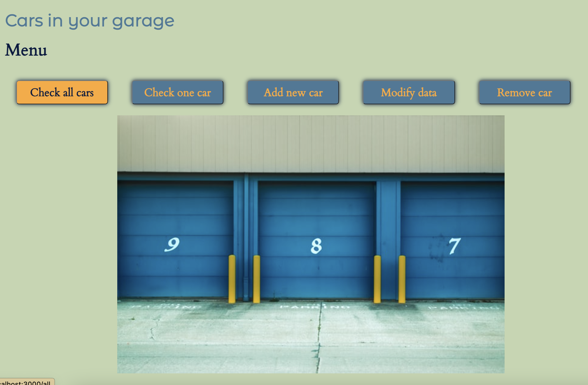
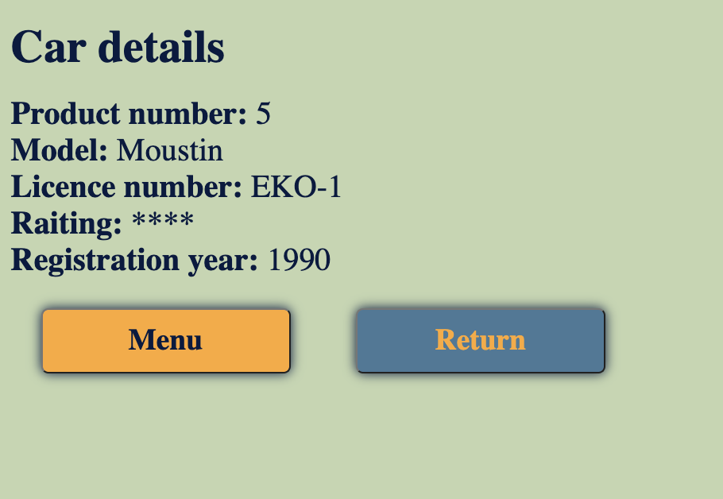

# NODE-MODULES assignment

This is a school assignment @Helsinki Business College for Node - modules, Express and EJS.
Assignment was made as end assignment of first course of Node.

## Built with

- NODE.js
- Express (WEB framework for Node )
- EJS (Embedded Java Script templating)
- HTML and CSS

## What I learned

- NODE, Express and EJS game more familiar with this task
- Learned to sort data with EJS and add footer component
- How to use "return to last page" command (used in RETURN buttons)

## To run this application

```zsh
$ npm install
```

and

```
$ node index
```

will start the app in browser localhost:3000

## Express

Express was installed by:

```zsh
$ npm install express --save
```

## EJS

EJS was installed by:

```
$ npm install ejs
```

## What you can do with the app

There is small database (JSON-file) of cars.
Cars are searched by product number.

You can select to get one car, list all cars to table (sorted with the product number), remove a car, change data (product number or rate stars can be changed) or/and add a new car.

There is also page which informs status or errors according to staus/error code.

## Screen shots




## Credits

Home/Menu page photo by <a href="https://unsplash.com/@steve_j?utm_source=unsplash&utm_medium=referral&utm_content=creditCopyText">Steve Johnson</a> on <a href="https://unsplash.com/s/photos/garage?utm_source=unsplash&utm_medium=referral&utm_content=creditCopyText">Unsplash</a>
